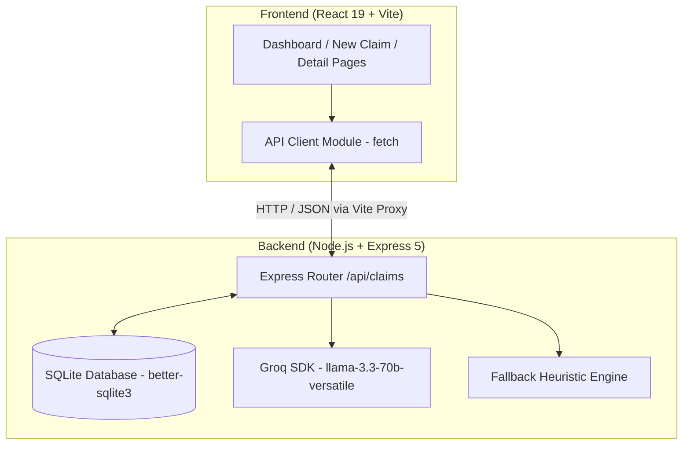

# L'Oréal Claims Intelligence Engine 🧪✨

A high-performance, full-stack application for managing product claim lifecycles and performing AI-powered clinical trial substantiation evaluations. Built specifically for L'Oréal R&I (Research & Innovation) scientists and clinical evaluators.

---

## 📌 Executive Summary

The **L'Oréal Claims Intelligence Engine** streamlines the validation workflow for cosmetic, skincare, haircare, suncare, and fragrance product claims. 
- **R&I Scientists** submit proposed products, claim statements, formula active ingredients, and claim categories.
- **Clinical Evaluators** input trial data and run automated AI evaluation assessments.
- **AI Engine (Groq LLM)** analyzes clinical methodology, sample sizes, placebo controls, and statistical significance ($p$-values) to generate a substantiation verdict, confidence score ($0-100$), and technical reasoning.

---

## 🏗️ Architecture Overview

The application follows a modern decoupled full-stack architecture with a React single-page frontend and an Express Node.js backend backed by SQLite.



### System Architecture Diagram & Data Flow

1. **Submission Phase**: Scientist submits claim details $\rightarrow$ Express POST `/api/claims` $\rightarrow$ Persisted in SQLite with `Submitted` status.
2. **Evaluation Phase**: Clinical Evaluator submits study text $\rightarrow$ Express POST `/api/claims/:id/evaluate`.
3. **AI Reasoning Engine**:
   - If `GROQ_API_KEY` is present: Queries Groq's `llama-3.3-70b-versatile` with JSON schema enforcement.
   - If `GROQ_API_KEY` is missing: Falls back to a deterministic heuristic engine searching for statistical indicators ($p$-values, double-blind controls, placebo groups).
4. **Persistence & Metrics**: Evaluation results, scores, and updated status (`Substantiated`, `Insufficient`, `Refuted`) are saved to SQLite and reflected live across client dashboards.

---

## 🛠️ Technology Stack

| Layer | Technology | Key Details |
| :--- | :--- | :--- |
| **Frontend** | React 19 + Vite | Fast HMR development server, React Router 7 |
| **Styling** | Vanilla CSS | Custom design system with glassmorphism, responsive grid, dynamic badges |
| **Backend** | Express 5 | Lightweight REST API running on Node.js |
| **Database** | SQLite (`better-sqlite3`) | Embedded WAL-mode database for zero-config persistence |
| **AI Integration** | Groq SDK | Powered by `llama-3.3-70b-versatile` for clinical text analysis |

---

## 📂 Project Directory Structure

```
LorealClaim/
├── README.md                 # Root documentation & architecture guide
├── client/                   # Frontend Vite + React application
│   ├── public/               # Static public assets
│   ├── src/
│   │   ├── pages/            # Page components (Dashboard, NewClaim, ClaimDetail)
│   │   ├── api.js            # Centralized API fetch layer
│   │   ├── App.jsx           # Main routing & header layout
│   │   ├── App.css           # Layout styles
│   │   ├── index.css         # Core CSS design system & dynamic badges
│   │   └── main.jsx          # React entry point
│   ├── package.json          # Frontend dependencies (React 19, React Router 7)
│   └── vite.config.js        # Vite configuration & /api proxy to http://localhost:4000
└── server/                   # Backend Express + SQLite + Groq application
    ├── src/
    │   ├── db.js             # SQLite initialization, schema creation & seeding
    │   ├── index.js          # REST API endpoints & Groq evaluation logic
    │   └── database.sqlite   # Local SQLite database instance (auto-created)
    ├── .env                  # Backend environment configuration
    └── package.json          # Backend dependencies (Express 5, better-sqlite3, groq-sdk)
```

---

## 📊 Database Schema

### Table: `claims`

| Field | Type | Description |
| :--- | :--- | :--- |
| `id` | `INTEGER PRIMARY KEY` | Auto-incremented unique ID |
| `product_name` | `TEXT NOT NULL` | Name of the cosmetic / skincare product |
| `category` | `TEXT NOT NULL` | Category (`Skincare`, `Haircare`, `Makeup`, `Fragrance`, `Suncare`) |
| `claim_text` | `TEXT NOT NULL` | Proposed claim statement |
| `claim_type` | `TEXT NOT NULL` | Type (`Efficacy`, `Sensory`, `Safety`, `Sustainability`, `Composition`) |
| `scientist` | `TEXT` | R&I Scientist submitting the claim |
| `formula` | `TEXT` | Active ingredients / formula specification |
| `study` | `TEXT` | Clinical study summary & trial methodology |
| `status` | `TEXT` | Current status (`Submitted`, `Substantiated`, `Insufficient`, `Refuted`) |
| `evaluation` | `TEXT (JSON)` | JSON string containing evaluation `verdict`, `score`, `reasoning`, `evaluator`, `created_at` |

---

## ⚡ API Endpoints Summary

| Method | Endpoint | Description |
| :--- | :--- | :--- |
| `GET` | `/api/meta` | Get metadata dropdown options (categories & claim types) |
| `GET` | `/api/claims` | List all claim submissions (newest first) |
| `GET` | `/api/claims/:id` | Get single claim details by ID |
| `POST` | `/api/claims` | Submit a new product claim |
| `POST` | `/api/claims/:id/evaluate` | Evaluate clinical study substantiation using AI |

---

## 🚀 Running Instructions

### Prerequisites

Ensure you have the following installed on your machine:
- **Node.js** (v18.0.0 or higher)
- **npm** (v9.0.0 or higher)

---

### Step 1: Environment Setup

Navigate to the `server` directory and check/create the `.env` file:

```bash
cd server
```

Create or edit `.env`:
```env
PORT=4000
GROQ_API_KEY=your_groq_api_key_here
```

> 💡 **Note**: If `GROQ_API_KEY` is not provided, the application will automatically run using its **smart heuristic fallback engine** so you can test all features offline.

---

### Step 2: Install Dependencies

Install dependencies for both **server** and **client**:

#### 1. Backend Server Dependencies
```bash
cd server
npm install
```

#### 2. Frontend Client Dependencies
```bash
cd ../client
npm install
```

---

### Step 3: Start Development Servers

You can start the server and client in two separate terminal windows.

#### Terminal 1: Backend Server (Port 4000)
```bash
cd server
npm run dev
```
*Outputs: `Claims Intelligence API listening on http://localhost:4000`*

#### Terminal 2: Frontend Client (Vite Dev Server)
```bash
cd client
npm run dev
```
*Outputs: Local URL (typically `http://localhost:5173` or `http://localhost:5174`)*

Open `http://localhost:5173` in your browser to start using the app.

---

### Step 4: Building for Production

To build the client application for production deployment:

```bash
cd client
npm run build
```

To preview the built client application locally:
```bash
npm run preview
```

---

## 💡 Usage Guide & Workflow

1. **View Claims**: Open the Dashboard (`/`) to review pre-seeded submissions, view summary metrics, and filter by status.
2. **Submit New Claim**: Click **+ New Submission** (`/new`), enter product details (e.g. *Revitalift Pro-Retinol Night Serum*), formula ingredients, and claim text, then submit.
3. **Run AI Evaluation**: Click on any submitted claim from the list (`/claims/:id`), paste clinical trial study details into the assessment form, and click **Run AI Assessment**.
4. **Analyze Results**: Review the instant substantiation verdict (`Substantiated`, `Insufficient`, or `Refuted`), technical score out of 100, and AI reasoning analysis.
